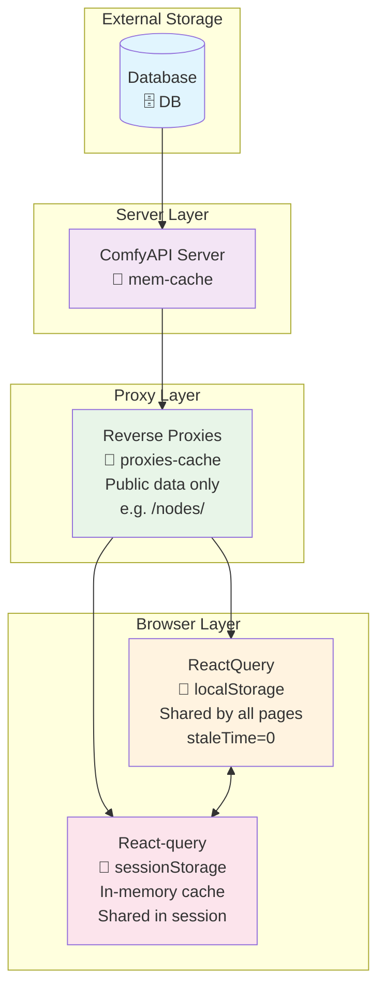
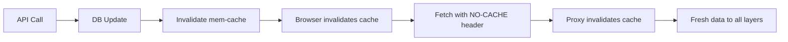

# Cache Control Architecture

## Data Storage Relationships

```mermaid
graph TB
    subgraph "External Storage"
        DB[(Database<br/>🗄️ DB)]
    end
    
    subgraph "Server Layer"
        MEM[ComfyAPI Server<br/>🧠 mem-cache]
    end
    
    subgraph "Proxy Layer"
        PROXY[Reverse Proxies<br/>🔄 proxies-cache<br/>Public data only<br/>e.g. /nodes/]
    end
    
    subgraph "Browser Layer"
        LS[ReactQuery<br/>💾 localStorage<br/>Shared by all pages<br/>staleTime=0]
        SM[React-query<br/>🔄 sessionStorage<br/>In-memory cache<br/>Shared in session]
    end
    
    DB --> MEM
    MEM --> PROXY
    PROXY --> LS
    PROXY --> SM
    LS <--> SM
    
    style DB fill:#e1f5fe
    style MEM fill:#f3e5f5
    style PROXY fill:#e8f5e8
    style LS fill:#fff3e0
    style SM fill:#fce4ec
```

## Cache Invalidation Flow

```mermaid
graph LR
    API[API Call] --> DB_UPDATE[DB Update]
    DB_UPDATE --> MEM_INV[Invalidate mem-cache]
    MEM_INV --> BROWSER_INV[Browser invalidates cache]
    BROWSER_INV --> NO_CACHE[Fetch with NO-CACHE header]
    NO_CACHE --> PROXY_INV[Proxy invalidates cache]
    PROXY_INV --> FRESH_DATA[Fresh data to all layers]
```